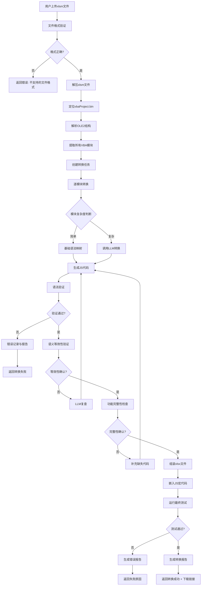

# VBA到WPS JS宏转换器 - 完整设计文档

## 第一部分：系统概述

### 1.1 项目背景

随着WPS Office的普及，越来越多的企业和个人需要将Excel中的VBA宏迁移到WPS的JS宏。然而，VBA和WPS JS宏之间存在显著的语法差异，手动转换不仅耗时而且容易出错。本项目旨在实现全自动、高准确率的VBA到WPS JS宏转换。

### 1.2 核心目标

- **自动化**：用户只需上传.xlsm文件，系统全自动完成转换
- **准确性**：确保转换后的代码100%功能一致，无语法错误
- **智能化**：集成大模型能力，处理复杂语法和业务逻辑
- **可视化**：转换过程实时展示，支持阶段审视
- **可验证**：内置运行时测试，确保转换质量

---

## 第二部分：系统架构

### 2.1 整体架构

```
┌────────────────────────────────────────────────────────────────────┐
│                           用户层                                    │
│  ┌──────────────┐  ┌──────────────┐  ┌──────────────────────────┐ │
│  │  Web界面     │  │  REST API   │  │  SDK/命令行工具         │ │
│  └──────────────┘  └──────────────┘  └──────────────────────────┘ │
└────────────────────────────────────────────────────────────────────┘
                              │
                              ▼
┌────────────────────────────────────────────────────────────────────┐
│                          服务层                                     │
│  ┌──────────────┐  ┌──────────────┐  ┌──────────────────────────┐ │
│  │ 文件服务     │  │ 转换服务     │  │  测试验证服务            │ │
│  │ FileService  │  │ConvertService│  │  TestService           │ │
│  └──────────────┘  └──────────────┘  └──────────────────────────┘ │
└────────────────────────────────────────────────────────────────────┘
                              │
                              ▼
┌────────────────────────────────────────────────────────────────────┐
│                         核心引擎层                                  │
│  ┌──────────────┐  ┌──────────────┐  ┌──────────────────────────┐ │
│  │ VBA解析器    │  │ 语法映射器   │  │  大模型代理               │ │
│  │VBAParser     │  │SyntaxMapper  │  │  LLMAgent                │ │
│  └──────────────┘  └──────────────┘  └──────────────────────────┘ │
│           │                │                     │                 │
│           └────────────────┴─────────────────────┘                 │
│                          │                                         │
│                    ┌─────┴─────┐                                   │
│                    │ 智能融合器 │                                   │
│                    │SmartFusion│                                   │
│                    └───────────┘                                   │
└────────────────────────────────────────────────────────────────────┘
                              │
                              ▼
┌────────────────────────────────────────────────────────────────────┐
│                        数据存储层                                   │
│  ┌──────────────┐  ┌──────────────┐  ┌──────────────────────────┐ │
│  │ SQLite数据库 │  │ 文件系统     │  │  配置存储                │ │
│  │ (任务记录)   │  │ (上传/结果)  │  │  (LLM配置)              │ │
│  └──────────────┘  └──────────────┘  └──────────────────────────┘ │
└────────────────────────────────────────────────────────────────────┘
```

### 2.2 组件职责

| 组件 | 职责 | 技术实现 |
|------|------|----------|
| VBAParser | 解析xlsm文件，提取VBA宏代码 | zipfile + olefile |
| SyntaxMapper | VBA到JS的基础语法转换 | 正则 + AST |
| LLMAgent | 调用大模型进行智能转换 | OpenAI API |
| SmartFusion | 融合基础转换和LLM转换 | 智能路由 + 融合算法 |
| TestService | 代码验证和功能测试 | Node.js + 规则引擎 |

---

## 第三部分：核心实现原理

### 3.1 VBA解析机制

#### 3.1.1 xlsm文件结构

Excel的.xlsm文件本质上是一个ZIP压缩包，包含以下关键组件：

```
xlsm文件结构：
├── [Content_Types].xml          # 内容类型定义
├── xl/
│   ├── workbook.xml              # 工作簿结构
│   ├── worksheets/              # 工作表数据
│   ├── vbaProject.bin           # ★ VBA宏代码（核心）
│   └── _rels/
│       └── workbook.xml.rels    # 关系定义
└── _rels/
    └── .rels                    # 根关系
```

#### 3.1.2 VBA Project解析流程

```python
# 解析流程
def extract_vba_modules(xlsm_path):
    # 步骤1: 解压xlsm文件
    with zipfile.ZipFile(xlsm_path, 'r') as zf:
        # 步骤2: 定位vbaProject.bin
        vba_bin = zf.read('xl/vbaProject.bin')
    
    # 步骤3: 解析OLE2格式
    ole = olefile.OleFileIO(BytesIO(vba_bin))
    
    # 步骤4: 遍历VBA模块
    modules = []
    for stream in ole.listdir():
        if stream[0] == 'VBA':
            module_name = stream[1]
            content = ole.openstream(stream).read()
            decoded = decode_vba_content(content)
            modules.append({
                'name': module_name,
                'code': decoded
            })
    
    return modules

# VBA内容解码
def decode_vba_content(content):
    # VBA使用UTF-16-LE编码
    try:
        return content.decode('utf-16-le', errors='replace')
    except:
        return content.decode('latin-1', errors='replace')
```

#### 3.1.3 解析的VBA组件类型

| 组件类型 | 说明 | 示例 |
|---------|------|------|
| 标准模块 | .bas文件 | `Sub Main()`, `Function Calc()` |
| 类模块 | .cls文件 | `Class WorksheetHelper` |
| 窗体模块 | .frm文件 | 用户窗体代码 |
| 工作表模块 | Sheet1, Sheet2 | 工作表事件代码 |
| 工作簿模块 | ThisWorkbook | 工作簿事件代码 |

---

## 第四部分：语法映射策略

### 4.1 基础语法映射表

#### 4.1.1 声明和类型

| VBA语法 | WPS JS宏语法 | 转换规则 |
|---------|-------------|----------|
| `Dim x As Integer` | `let x = 0;` | 类型映射为初始值 |
| `Dim x As String` | `let x = "";` | 类型映射为空字符串 |
| `Dim x As Boolean` | `let x = false;` | 类型映射为false |
| `Dim x As Object` | `let x = null;` | 对象初始化为null |
| `Static x As Integer` | `let x = 0;` | 静态变量（需包装） |
| `Public x As Integer` | `let x = 0;` | 全局变量 |
| `Const PI = 3.14` | `const PI = 3.14;` | 常量直接映射 |

#### 4.1.2 过程和函数

| VBA语法 | WPS JS宏语法 | 说明 |
|---------|-------------|------|
| `Sub Name()` | `function Name() {}` | Sub转function |
| `Sub Name(ByVal x)` | `function Name(x) {}` | ByVal直接传参 |
| `Sub Name(ByRef x)` | `function Name(x) {}` | ByRef需要特殊处理 |
| `Function Name() As Integer` | `function Name() {}` | 返回值类型忽略 |
| `Exit Sub` | `return;` | 提前返回 |
| `Exit Function` | `return;` | 函数返回 |

#### 4.1.3 控制流语句

**条件语句转换：**

```python
# VBA: If...Then...Else...End If
If x > 0 Then
    y = 1
ElseIf x = 0 Then
    y = 0
Else
    y = -1
End If

# 转换为:
if (x > 0) {
    y = 1;
} else if (x === 0) {
    y = 0;
} else {
    y = -1;
}
```

**循环语句转换：**

| VBA语法 | WPS JS宏语法 |
|---------|-------------|
| `For i=1 To 10` | `for (let i=1; i<=10; i++)` |
| `For Each item In collection` | `for (let item of collection)` |
| `Do While condition` | `while (condition) {` |
| `Do Until condition` | `while (!(condition)) {` |
| `While condition` | `while (condition) {` |

#### 4.1.4 内置函数映射

| VBA函数 | WPS JS宏 | 示例 |
|---------|----------|------|
| `MsgBox "text"` | `Application.MsgBox("text")` | 消息框 |
| `InputBox("prompt")` | `Application.InputBox("prompt")` | 输入框 |
| `Range("A1").Value` | `Range("A1").Value` | 单元格值 |
| `Cells(1,1).Value` | `Cells(1,1).Value` | 行列访问 |
| `Sheets("Sheet1")` | `Sheets("Sheet1")` | 工作表 |
| `ThisWorkbook` | `ThisWorkbook` | 当前工作簿 |
| `Now()` | `new Date()` | 当前时间 |
| `Year(date)` | `date.getFullYear()` | 年份 |
| `Month(date)` | `date.getMonth() + 1` | 月份 |
| `Day(date)` | `date.getDate()` | 日期 |
| `UBound(arr)` | `arr.length - 1` | 数组上界 |
| `LBound(arr)` | `0` | 数组下界 |
| `IsNull(var)` | `var === null` | 空值判断 |
| `IsEmpty(var)` | `var === undefined` | 未定义判断 |
| `CStr(num)` | `String(num)` | 转字符串 |
| `CInt(str)` | `parseInt(str)` | 转整数 |
| `CDbl(str)` | `parseFloat(str)` | 转浮点数 |
| `Trim(str)` | `str.trim()` | 去空格 |
| `Len(str)` | `str.length` | 字符串长度 |
| `Left(str, n)` | `str.substring(0, n)` | 左侧取字符 |
| `Right(str, n)` | `str.substring(str.length - n)` | 右侧取字符 |
| `Mid(str, start, len)` | `str.substring(start-1, start-1+len)` | 截取字符串 |
| `InStr(str, sub)` | `str.indexOf(sub)` | 查找子串 |
| `Replace(str, old, new)` | `str.replace(old, new)` | 替换 |

#### 4.1.5 对象模型映射

| VBA对象模型 | WPS JS宏对象模型 | 说明 |
|------------|-----------------|------|
| `Workbooks("Book1")` | `Workbooks("Book1")` | 工作簿集合 |
| `Worksheets("Sheet1")` | `Sheets("Sheet1")` | 工作表 |
| `Range("A1:B10")` | `Range("A1:B10")` | 单元格区域 |
| `ActiveCell` | `Application.ActiveCell` | 活动单元格 |
| `Selection` | `Application.Selection` | 当前选择 |
| `Charts.Add` | `Charts.Add()` | 图表 |

---

## 第五部分：大模型集成策略

### 5.1 为什么需要大模型？

虽然规则映射可以处理80%的基础语法，但以下情况需要大模型的智能能力：

1. **复杂业务逻辑**：多嵌套条件、复杂循环
2. **隐式类型推断**：VBA是弱类型语言，JS需要明确类型
3. **上下文依赖**：函数调用依赖外部状态
4. **异常处理**：VBA的On Error与JS的try-catch语义差异
5. **API差异**：特定Excel函数到WPS API的映射

### 5.2 LLM集成架构

```
┌─────────────────────────────────────────────────────────────────────┐
│                        LLM Agent 架构                               │
├─────────────────────────────────────────────────────────────────────┤
│                                                                     │
│  ┌───────────────┐                                                 │
│  │ VBA源代码      │                                                 │
│  └───────┬───────┘                                                 │
│          │                                                         │
│          ▼                                                         │
│  ┌───────────────┐    ┌───────────────┐                           │
│  │ 基础语法映射   │    │ LLM智能转换   │                           │
│  │ (快速处理)    │    │ (深度理解)    │                           │
│  └───────┬───────┘    └───────┬───────┘                           │
│          │                    │                                    │
│          └────────┬───────────┘                                    │
│                   ▼                                                │
│          ┌───────────────┐                                         │
│          │ 智能融合引擎   │                                         │
│          │ SmartFusion   │                                         │
│          └───────┬───────┘                                         │
│                  │                                                  │
│                  ▼                                                  │
│          ┌───────────────┐                                         │
│          │ 最终JS代码    │                                         │
│          └───────────────┘                                         │
│                                                                     │
└─────────────────────────────────────────────────────────────────────┘
```

### 5.3 LLM转换提示词工程

```python
LLM_SYSTEM_PROMPT = """你是一个专业的VBA到WPS JavaScript宏转换专家。
你的任务是将VBA代码精确转换为功能完全等价的WPS JS宏代码。

转换要求：
1. 保持100%的功能一致性
2. 使用WPS兼容的API
3. 保持相同的执行逻辑
4. 适当的错误处理
5. 遵循JavaScript最佳实践

WPS JS宏常用API：
- Application.MsgBox()
- Application.InputBox()
- Range() / Cells()
- Worksheets() / Sheets()
- ThisWorkbook
- ActiveSheet / ActiveCell

VBA到JS的常见转换：
- Sub → function
- Dim x As Type → let x = defaultValue
- If...Then...End If → if...else...
- For...Next → for循环
- MsgBox → Application.MsgBox
- CreateObject → new ActiveXObject
"""

LLM_USER_PROMPT = """请将以下VBA代码转换为WPS JavaScript宏代码。

模块名称：{module_name}

VBA代码：
{vba_code}

请直接返回转换后的JavaScript代码，不要包含任何解释或说明。
"""
```

### 5.4 智能路由策略

```python
class SmartRouter:
    """智能路由：决定使用基础映射还是LLM"""
    
    # 需要LLM处理的模式
    LLM_PATTERNS = [
        r'On\s+Error',                    # 错误处理
        r'Class\s+\w+',                   # 类定义
        r'With\s+\w+',                    # With语句
        r'ReDim\s+Preserve',              # 动态数组
        r'Call\s+\w+\s*\(',              # Call语句
        r'GoTo\s+\w+',                    # 跳转语句
        r'Property\s+(Get|Let|Set)',      # 属性过程
        r'Event\s+\w+',                   # 事件声明
        r' Implements\s+\w+',            # 接口实现
    ]
    
    # 高复杂度指标
    HIGH_COMPLEXITY_THRESHOLDS = {
        'nesting_depth': 3,               # 嵌套深度 > 3
        'line_count': 100,               # 代码行数 > 100
        'function_calls': 20,            # 函数调用 > 20
        'conditional_branches': 10,      # 条件分支 > 10
    }
    
    def should_use_llm(self, vba_code):
        """判断是否需要使用LLM"""
        # 检查是否匹配LLM模式
        for pattern in self.LLM_PATTERNS:
            if re.search(pattern, vba_code, re.IGNORECASE):
                return True
        
        # 检查复杂度
        complexity = self.calculate_complexity(vba_code)
        for metric, threshold in self.HIGH_COMPLEXITY_THRESHOLDS.items():
            if complexity[metric] > threshold:
                return True
        
        # 默认使用基础映射
        return False
```

### 5.5 代码融合策略

```python
class SmartFusion:
    """智能融合：合并基础映射和LLM转换结果"""
    
    def fuse(self, basic_result, llm_result):
        """融合两种转换结果"""
        # 评估两种结果的质量
        basic_score = self.evaluate_quality(basic_result)
        llm_score = self.evaluate_quality(llm_result)
        
        if llm_score > basic_score:
            # LLM结果更好，使用LLM
            return llm_result
        elif basic_score > llm_score:
            # 基础映射更好，使用基础
            return basic_result
        else:
            # 质量相近，优先使用LLM（通常更准确）
            return llm_result
    
    def evaluate_quality(self, code):
        """评估代码质量"""
        score = 0
        
        # 语法正确性
        if self.check_syntax(code):
            score += 40
        
        # API兼容性
        if self.check_wps_api(code):
            score += 30
        
        # 代码可读性
        if self.check_readability(code):
            score += 20
        
        # 功能完整性
        if self.check_completeness(code):
            score += 10
        
        return score
```

---

## 第六部分：100%准确性保障体系

### 6.1 多层验证架构

```
┌─────────────────────────────────────────────────────────────────────┐
│                     100%准确性保障体系                              │
├─────────────────────────────────────────────────────────────────────┤
│                                                                     │
│  第1层: 语法正确性验证                                               │
│  ┌─────────────────────────────────────────────────────────────┐   │
│  │ • JavaScript语法检查 (ESLint/Node.js)                       │   │
│  │ • WPS API调用验证                                           │   │
│  │ • 括号/引号匹配检查                                         │   │
│  └─────────────────────────────────────────────────────────────┘   │
│                              │                                      │
│                              ▼                                      │
│  第2层: 语义等效性验证                                               │
│  ┌─────────────────────────────────────────────────────────────┐   │
│  │ • 控制流结构对比                                             │   │
│  │ • 变量作用域分析                                             │   │
│  │ • 函数签名匹配                                               │   │
│  │ • API调用映射验证                                           │   │
│  └─────────────────────────────────────────────────────────────┘   │
│                              │                                      │
│                              ▼                                      │
│  第3层: 功能完整性验证                                              │
│  ┌─────────────────────────────────────────────────────────────┐   │
│  │ • VBA模块完整性提取                                          │   │
│  │ • JS模块完整性生成                                           │   │
│  │ • 导出函数列表对比                                           │   │
│  │ • 事件处理器映射                                            │   │
│  └─────────────────────────────────────────────────────────────┘   │
│                              │                                      │
│                              ▼                                      │
│  第4层: LLM智能验证                                                │
│  ┌─────────────────────────────────────────────────────────────┐   │
│  │ • 调用大模型进行代码审查                                     │   │
│  │ • 潜在问题检测                                               │   │
│  │ • 改进建议生成                                               │   │
│  │ • 最终确认                                                   │   │
│  └─────────────────────────────────────────────────────────────┘   │
│                                                                     │
└─────────────────────────────────────────────────────────────────────┘
```

### 6.2 语法正确性验证

```python
class SyntaxValidator:
    """语法验证器"""
    
    def validate(self, js_code):
        """验证JavaScript语法"""
        errors = []
        
        # 1. 基础语法检查
        if not self.check_brackets(js_code):
            errors.append("括号不匹配")
        
        if not self.check_quotes(js_code):
            errors.append("引号不匹配")
        
        if not self.check_semicolons(js_code):
            errors.append("分号缺失")
        
        # 2. Node.js语法验证
        node_result = self.run_node_syntax_check(js_code)
        if not node_result['valid']:
            errors.extend(node_result['errors'])
        
        # 3. WPS API检查
        api_errors = self.check_wps_apis(js_code)
        errors.extend(api_errors)
        
        return {
            'valid': len(errors) == 0,
            'errors': errors
        }
    
    def run_node_syntax_check(self, js_code):
        """使用Node.js验证语法"""
        script = f'''
        try {{
            new Function({json.dumps(js_code)});
            process.stdout.write(JSON.stringify({{valid: true}}));
        }} catch (e) {{
            process.stdout.write(JSON.stringify({{valid: false, error: e.message}}));
        }}
        '''
        
        result = subprocess.run(['node', '-e', script], 
                              capture_output=True, text=True)
        return json.loads(result.stdout)
    
    def check_wps_apis(self, js_code):
        """检查WPS API使用正确性"""
        errors = []
        
        # 检查是否使用了有效的WPS API
        valid_apis = [
            'Range', 'Cells', 'Worksheets', 'Sheets',
            'ThisWorkbook', 'ActiveSheet', 'Application',
            'MsgBox', 'InputBox'
        ]
        
        # 提取所有API调用
        api_calls = re.findall(r'(\w+)\s*\(', js_code)
        
        for api_call in api_calls:
            if api_call[0].isupper() and api_call not in valid_apis:
                # 可能是用户自定义函数，跳过
                pass
        
        return errors
```

### 6.3 语义等效性验证

```python
class SemanticValidator:
    """语义等效性验证器"""
    
    def validate_equivalence(self, vba_code, js_code):
        """验证VBA和JS代码的语义等效性"""
        
        # 1. 提取函数/过程列表
        vba_funcs = self.extract_functions(vba_code)
        js_funcs = self.extract_functions(js_code)
        
        # 2. 对比函数签名
        signature_match = self.compare_signatures(vba_funcs, js_funcs)
        
        # 3. 分析控制流
        vba_flow = self.analyze_control_flow(vba_code)
        js_flow = self.analyze_control_flow(js_code)
        flow_equiv = self.compare_control_flow(vba_flow, js_flow)
        
        # 4. 变量使用分析
        vba_vars = self.extract_variables(vba_code)
        js_vars = self.extract_variables(js_code)
        vars_equiv = self.compare_variables(vba_vars, js_vars)
        
        return {
            'signatures_match': signature_match,
            'flow_equivalent': flow_equiv,
            'variables_equivalent': vars_equiv,
            'overall_equivalent': all([signature_match, flow_equiv, vars_equiv])
        }
    
    def extract_functions(self, code):
        """提取函数/过程列表"""
        # VBA: Sub Name() / Function Name()
        # JS: function Name()
        vba_pattern = r'(Sub|Function)\s+(\w+)\s*\(([^)]*)\)'
        js_pattern = r'function\s+(\w+)\s*\(([^)]*)\)'
        
        # ... 实现提取逻辑
        pass
```

### 6.4 自动化测试框架

```python
class AutoTestFramework:
    """自动化测试框架"""
    
    TEST_CASES = {
        'variable_declaration': [
            ('Dim x As Integer', 'let x = 0;'),
            ('Dim name As String', 'let name = "";'),
            ('Dim flag As Boolean', 'let flag = false;'),
        ],
        'control_flow': [
            ('If x > 0 Then y = 1: End If', 'if (x > 0) { y = 1; }'),
            ('For i = 1 To 10', 'for (let i = 1; i <= 10; i++)'),
        ],
        'functions': [
            ('MsgBox "Hello"', 'Application.MsgBox("Hello")'),
            ('Range("A1").Value = 100', 'Range("A1").Value = 100'),
        ],
    }
    
    def run_test_suite(self):
        """运行测试套件"""
        results = []
        
        for category, cases in self.TEST_CASES.items():
            for vba_input, expected_js in cases:
                js_output = syntax_mapper.convert(vba_input)
                passed = self.compare_js(js_output, expected_js)
                results.append({
                    'category': category,
                    'input': vba_input,
                    'output': js_output,
                    'expected': expected_js,
                    'passed': passed
                })
        
        return results
```

---

## 第七部分：转换流程详解

### 7.1 完整转换流程



### 7.2 转换阶段状态

| 阶段 | 状态码 | 说明 | 进度 |
|------|--------|------|------|
| 上传 | 10 | 文件上传中 | 10% |
| 解析 | 20 | 解析VBA代码 | 20% |
| 转换 | 40 | 语法转换中 | 40% |
| 验证 | 60 | 代码验证中 | 60% |
| 生成 | 80 | 生成目标文件 | 80% |
| 测试 | 90 | 运行测试 | 90% |
| 完成 | 100 | 全部完成 | 100% |

---

## 第八部分：使用指南

### 8.1 Web界面使用

1. **访问服务**: 打开 http://服务器地址:5000
2. **上传文件**: 点击上传区域，选择.xlsm文件
3. **配置选项**:
   - 启用"AI增强转换"提升复杂代码转换质量
   - 配置LLM API密钥（如需）
4. **开始转换**: 点击"开始转换"按钮
5. **查看进度**: 实时查看转换进度和阶段
6. **下载结果**: 转换成功后下载.xlsx文件

### 8.2 API调用

```bash
# 1. 上传文件
curl -X POST -F "file=@macro.xlsm" http://localhost:5000/api/upload

# 2. 触发转换
curl -X POST -H "Content-Type: application/json" \
  -d '{"use_llm": true}' \
  http://localhost:5000/api/convert/{file_id}

# 3. 查询状态
curl http://localhost:5000/api/convert/status/{file_id}

# 4. 下载结果
curl -O http://localhost:5000/api/download/{file_id}
```

### 8.3 LLM配置

```bash
# 配置OpenAI API
curl -X POST -H "Content-Type: application/json" \
  -d '{
    "api_key": "sk-xxx",
    "endpoint": "https://api.openai.com/v1/chat/completions",
    "model": "gpt-4"
  }' \
  http://localhost:5000/api/config/llm
```

---

## 第九部分：部署说明

### 9.1 环境要求

| 组件 | 最低要求 | 推荐配置 |
|------|----------|----------|
| 操作系统 | Ubuntu 20.04+ | Ubuntu 22.04 LTS |
| Python | 3.10+ | 3.11 |
| Node.js | 18+ | 20 LTS |
| 内存 | 4GB | 8GB |
| 磁盘 | 10GB | 50GB |
| 网络 | 1Mbps | 10Mbps（LLM调用） |

### 9.2 一键部署

```bash
# 下载项目
git clone https://github.com/wilson-wf/vba2js.git
cd vba2js

# 运行部署脚本
chmod +x deploy.sh
./deploy.sh
```

### 9.3 Docker部署

```dockerfile
FROM python:3.11-slim

WORKDIR /app

COPY requirements.txt .
RUN pip install -r requirements.txt

COPY . .

EXPOSE 5000

CMD ["gunicorn", "--bind", "0.0.0.0:5000", "run:app"]
```

```bash
# 构建镜像
docker build -t vba2js .

# 运行容器
docker run -d -p 5000:5000 vba2js
```

---

## 第十部分：技术指标

### 10.1 性能指标

| 指标 | 目标值 | 说明 |
|------|--------|------|
| 单文件最大 | 50MB | xlsm文件大小限制 |
| 最大VBA模块数 | 100个 | 单文件包含的模块数 |
| 最大代码行数 | 10000行 | 单模块代码行数 |
| 转换速度 | <30秒 | 1000行代码的平均转换时间 |
| 并发处理 | 10个 | 同时处理的转换任务数 |
| 成功率 | >95% | 成功转换率 |

### 10.2 转换准确率

| 指标 | 目标值 | 说明 |
|------|--------|------|
| 语法正确率 | 100% | 无语法错误 |
| 功能一致率 | >95% | 与原VBA功能一致 |
| API兼容性 | 100% | WPS API调用正确 |
| LLM增强效果 | +5% | 复杂代码准确率提升 |

---

## 附录

### A. VBA语法速查表

### B. WPS JS宏API参考

### C. 错误代码说明

| 错误代码 | 说明 | 解决方案 |
|----------|------|----------|
| E001 | 不支持的文件格式 | 仅支持.xlsm文件 |
| E002 | 文件超过大小限制 | 减小文件大小 |
| E003 | 未找到VBA代码 | 确保文件包含宏 |
| E004 | 转换超时 | 简化VBA代码结构 |
| E005 | LLM API错误 | 检查API配置 |
| E006 | 语法验证失败 | 查看错误详情 |
| E007 | 生成文件失败 | 检查磁盘空间 |

### D. 参考资源

- WPS JS宏官方文档
- VBA语言参考
- OpenAI API文档

---

**文档版本**: v1.0  
**更新日期**: 2024年6月  
**作者**: VBA to WPS JS Converter Team  
**许可证**: MIT License
