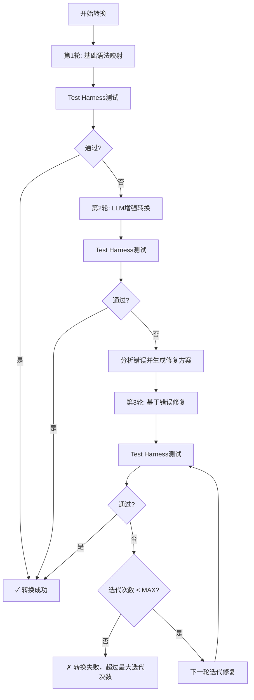

# VBA到WPS JS宏转换器 - Test Harness架构设计 v2.0

## 第一部分：Test Harness工程方法论

### 1.1 核心原则

Test Harness（测试框架/试验台）方法论的核心是：**构建->测试->迭代->修复**的完整闭环，确保最终交付物100%符合原始要求。

```
┌─────────────────────────────────────────────────────────────────────┐
│                    Test Harness方法论概览                           │
├─────────────────────────────────────────────────────────────────────┤
│                                                                     │
│  ┌─────────────────────────────────────────────────────────────┐  │
│  │  第0步: Golden Master捕获 (必须首先执行)                     │  │
│  │  • 在原始Excel中运行所有VBA宏                                │  │
│  │  • 记录所有副作用（单元格值、文件输出等）                    │  │
│  │  • 生成Behavioral Snapshot（行为快照）                       │  │
│  └─────────────────────────────────────────────────────────────┘  │
│                              │                                      │
│                              ▼                                      │
│  ┌─────────────────────────────────────────────────────────────┐  │
│  │  Build Harness: 自动转换和构建系统                          │  │
│  └─────────────────────────────────────────────────────────────┘  │
│                              │                                      │
│                              ▼                                      │
│  ┌─────────────────────────────────────────────────────────────┐  │
│  │  Test Harness: 统一测试环境                                  │  │
│  │  ┌─────────────────────┐  ┌───────────────────────────────┐  │  │
│  │  │ WPS JS仿真环境      │  │ Assertion Engine (断言引擎)   │  │  │
│  │  │ (模拟WPS运行时)      │  │ (验证功能一致性)             │  │  │
│  │  └─────────────────────┘  └───────────────────────────────┘  │  │
│  └─────────────────────────────────────────────────────────────┘  │
│                              │                                      │
│                              ▼                                      │
│  ┌─────────────────────────────────────────────────────────────┐  │
│  │  验证结果评估                                               │  │
│  │  • 行为对比: VBA vs JS                                      │  │
│  │  • 误差分析: 找出差异                                      │  │
│  └─────────────────────────────────────────────────────────────┘  │
│                              │                                      │
│                              │ (发现问题)                           │
│                              ▼                                      │
│  ┌─────────────────────────────────────────────────────────────┐  │
│  │  迭代修复循环 (Iterative Refinement)                        │  │
│  │  • 第1轮: 基础语法映射                                      │  │
│  │  • 第2轮: LLM增强转换                                       │  │
│  │  • 第3轮: 基于错误反馈修复                                 │  │
│  │  • 第N轮: 直到100%通过                                     │  │
│  └─────────────────────────────────────────────────────────────┘  │
│                              │                                      │
│                              │ (通过)                              │
│                              ▼                                      │
│  ┌─────────────────────────────────────────────────────────────┐  │
│  │  ✓ 最终交付: 100%功能一致的WPS JS宏                         │  │
│  └─────────────────────────────────────────────────────────────┘  │
│                                                                     │
└─────────────────────────────────────────────────────────────────────┘
```

### 1.2 关键概念

| 术语 | 说明 | 重要性 |
|------|------|--------|
| **Golden Master** | 原始VBA宏的行为快照，作为"黄金标准" | ⭐⭐⭐⭐⭐ |
| **Behavioral Snapshot** | VBA运行后的完整状态（单元格值、工作表等） | ⭐⭐⭐⭐⭐ |
| **Test Harness** | 模拟WPS运行环境，提供统一测试平台 | ⭐⭐⭐⭐⭐ |
| **Assertion Engine** | 验证VBA和JS功能一致性的断言系统 | ⭐⭐⭐⭐⭐ |
| **Iterative Refinement** | 测试→发现→修复→再测试的循环 | ⭐⭐⭐⭐⭐ |
| **Max Iterations** | 最大迭代次数，防止无限循环 | ⭐⭐⭐⭐ |

---

## 第二部分：V2.0 系统架构

### 2.1 五层Harness架构

```
┌─────────────────────────────────────────────────────────────────────────┐
│                        第5层: 交付层                                    │
│              (最终交付100%功能一致的文件)                              │
├─────────────────────────────────────────────────────────────────────────┤
│                        第4层: 迭代修复循环                              │
│              (测试→发现→修复→再测试，直至通过)                         │
├─────────────────────────────────────────────────────────────────────────┤
│                        第3层: Test Harness                              │
│  ┌─────────────────────────┐  ┌─────────────────────────────────────┐ │
│  │  WPS JS仿真环境        │  │  Assertion Engine (断言引擎)         │ │
│  │  • Range/Cells模拟     │  │  • 逐单元格值对比                     │ │
│  │  • Worksheets模拟      │  │  • 函数返回值验证                     │ │
│  │  • MsgBox/InputBox模拟 │  │  • 事件触发验证                       │ │
│  │  • 文件I/O模拟         │  │  • 异常处理验证                       │ │
│  └─────────────────────────┘  └─────────────────────────────────────┘ │
├─────────────────────────────────────────────────────────────────────────┤
│                        第2层: Build Harness                              │
│  ┌─────────────────────────┐  ┌─────────────────────────────────────┐ │
│  │  VBA解析器             │  │  转换器(基础映射+LLM)               │ │
│  │  提取原始VBA代码       │  │  生成JS宏代码                        │ │
│  └─────────────────────────┘  └─────────────────────────────────────┘ │
├─────────────────────────────────────────────────────────────────────────┤
│                        第1层: Golden Master捕获                         │
│  ┌───────────────────────────────────────────────────────────────────┐ │
│  │  • 运行原始VBA宏                                                    │ │
│  │  • 捕获所有状态: 单元格值/公式/格式                                 │ │
│  │  • 生成Behavioral Snapshot (行为快照)                              │ │
│  └───────────────────────────────────────────────────────────────────┘ │
└─────────────────────────────────────────────────────────────────────────┘
```

---

## 第三部分：Golden Master捕获详解

### 3.1 行为快照定义

**Behavioral Snapshot**（行为快照）是原始VBA宏运行后的完整Excel状态，包括：

```json
{
  "snapshot_id": "uuid",
  "timestamp": "2024-06-06T10:00:00Z",
  "worksheets": {
    "Sheet1": {
      "cells": {
        "A1": { "value": 100, "formula": "", "number_format": "0.00" },
        "A2": { "value": 200, "formula": "=A1*2", "number_format": "0" },
        "B1": { "value": "Hello", "formula": "", "number_format": "@" }
      }
    },
    "Sheet2": {
      "cells": {}
    }
  },
  "side_effects": {
    "files_created": [],
    "files_modified": [],
    "console_output": "",
    "msgbox_calls": [],
    "inputbox_calls": []
  },
  "function_results": {
    "CalculateSum": { "inputs": [1, 2], "output": 3 },
    "ProcessData": { "inputs": ["test"], "output": "PROCESSED" }
  },
  "metadata": {
    "vba_functions": ["CalculateSum", "ProcessData", "Button1_Click"],
    "modules": ["Module1", "Module2", "ThisWorkbook"]
  }
}
```

### 3.2 Golden Master捕获流程

```python
class GoldenMasterCapturer:
    """Golden Master捕获器 - VBA行为快照"""
    
    def capture(self, xlsm_path, test_cases):
        """完整捕获原始VBA的行为"""
        
        snapshots = []
        
        for test_case in test_cases:
            # 1. 复制原始文件
            temp_file = self.create_temp_copy(xlsm_path)
            
            # 2. 初始化测试场景
            self.setup_test_scene(temp_file, test_case)
            
            # 3. 运行指定的VBA宏
            self.run_vba_macro(temp_file, test_case['macro_name'])
            
            # 4. 捕获完整状态
            snapshot = self.capture_workbook_state(temp_file)
            
            # 5. 保存快照
            snapshots.append({
                'test_case': test_case,
                'snapshot': snapshot
            })
        
        return snapshots
    
    def capture_workbook_state(self, file_path):
        """捕获工作簿的完整状态"""
        import openpyxl
        
        wb = openpyxl.load_workbook(file_path, data_only=True)
        
        state = {
            'worksheets': {},
            'named_ranges': {},
            'defined_names': []
        }
        
        for sheet_name in wb.sheetnames:
            ws = wb[sheet_name]
            state['worksheets'][sheet_name] = self.capture_worksheet_state(ws)
        
        # 捕获命名区域
        for name in wb.defined_names.definedNames:
            state['named_ranges'][name.name] = name.attr_text
        
        # 捕获全局定义
        wb.close()
        
        return state
    
    def capture_worksheet_state(self, worksheet):
        """捕获单个工作表状态"""
        cells = {}
        
        for row in worksheet.iter_rows():
            for cell in row:
                if cell.value is not None:
                    cell_id = f"{cell.column_letter}{cell.row}"
                    cells[cell_id] = {
                        'value': cell.value,
                        'data_type': cell.data_type,
                        'number_format': cell.number_format,
                        'font': cell.font.name if cell.font else None,
                        'alignment': str(cell.alignment) if cell.alignment else None
                    }
        
        return {
            'cells': cells,
            'row_dimensions': {str(r): worksheet.row_dimensions[r].height 
                             for r in worksheet.row_dimensions},
            'column_dimensions': {c: worksheet.column_dimensions[c].width 
                                 for c in worksheet.column_dimensions}
        }
```

---

## 第四部分：Test Harness实现详解

### 4.1 WPS JS仿真环境设计

```python
class WPSSimulator:
    """WPS JS宏仿真环境 - 模拟真实的WPS运行时"""
    
    def __init__(self):
        self.workbook = None
        self.worksheets = {}
        self.active_sheet = None
        self.active_cell = None
        
        # 模拟的WPS API
        self.Application = WPSApplication(self)
    
    def load_workbook(self, file_path):
        """加载工作簿"""
        import openpyxl
        self.workbook = openpyxl.load_workbook(file_path)
        
        for sheet_name in self.workbook.sheetnames:
            self.worksheets[sheet_name] = WPSWorksheet(self, sheet_name)
        
        if self.workbook.sheetnames:
            self.active_sheet = self.worksheets[self.workbook.sheetnames[0]]
    
    def execute_js_macro(self, js_code, function_name, *args):
        """执行JS宏并捕获状态变化"""
        # 使用Node.js执行JavaScript
        # 同时注入模拟的WPS API
        result = self._execute_in_node(js_code, function_name, *args)
        
        # 返回执行结果和当前状态快照
        return {
            'result': result,
            'state': self.capture_current_state()
        }
    
    def capture_current_state(self):
        """捕获当前状态（与Golden Master相同格式）"""
        state = {
            'worksheets': {},
            'named_ranges': {},
            'defined_names': []
        }
        
        for sheet_name, ws in self.worksheets.items():
            state['worksheets'][sheet_name] = ws.capture_state()
        
        return state
    
    def _execute_in_node(self, js_code, function_name, *args):
        """在Node.js中执行JS宏"""
        import subprocess
        import json
        
        # 构建完整的JS脚本
        wrapper = f'''
        // 注入WPS模拟API
        {self._generate_wps_mock_api()}
        
        // 用户的JS宏代码
        {js_code}
        
        // 执行指定函数
        try {{
            let result = {function_name}({', '.join(json.dumps(a) for a in args)});
            console.log(JSON.stringify({{success: true, result: result}}));
        }} catch (e) {{
            console.log(JSON.stringify({{success: false, error: e.message}}));
        }}
        '''
        
        result = subprocess.run(['node', '-e', wrapper], 
                              capture_output=True, text=True, timeout=30)
        
        return json.loads(result.stdout)
    
    def _generate_wps_mock_api(self):
        """生成模拟的WPS API"""
        return '''
        // WPS JS宏模拟API
        const Range = function(cell) {
            return {
                value: mockRangeValues[cell],
                Value: mockRangeValues[cell],
                set value(val) { mockRangeValues[cell] = val; },
                set Value(val) { mockRangeValues[cell] = val; }
            };
        };
        
        const Application = {
            MsgBox: function(text) { mockMsgBoxCalls.push(text); },
            InputBox: function(prompt) { 
                mockInputBoxCalls.push(prompt); 
                return mockInputBoxReturns.shift(); 
            },
            get ActiveCell() { return Range(mockActiveCell); },
            get ActiveSheet() { return { Name: mockActiveSheetName }; }
        };
        
        const ThisWorkbook = {
            Sheets: function(name) { return { Range: Range }; },
            Worksheets: function(name) { return { Range: Range }; }
        };
        
        const Worksheets = function(name) { return { Range: Range }; };
        const Sheets = function(name) { return { Range: Range }; };
        const Cells = function(row, col) { return Range(getColumnName(col) + row); };
        
        // 全局变量
        let mockRangeValues = {};
        let mockMsgBoxCalls = [];
        let mockInputBoxCalls = [];
        let mockInputBoxReturns = [];
        let mockActiveCell = 'A1';
        let mockActiveSheetName = 'Sheet1';
        '''
```

### 4.2 模拟对象完整实现

```python
class WPSWorksheet:
    """模拟WPS Worksheet对象"""
    
    def __init__(self, simulator, name):
        self.simulator = simulator
        self.name = name
        self.cells = {}
    
    def Range(self, address):
        """获取Range对象"""
        return WPSRange(self, address)
    
    def get_cell(self, address):
        """获取单元格值"""
        return self.cells.get(address, {'value': None})
    
    def set_cell(self, address, value):
        """设置单元格值"""
        self.cells[address] = {'value': value}
    
    def capture_state(self):
        """捕获工作表状态"""
        return {'cells': self.cells}

class WPSRange:
    """模拟WPS Range对象"""
    
    def __init__(self, worksheet, address):
        self.worksheet = worksheet
        self.address = address
    
    @property
    def Value(self):
        """获取值"""
        return self.worksheet.get_cell(self.address)['value']
    
    @Value.setter
    def Value(self, value):
        """设置值"""
        self.worksheet.set_cell(self.address, value)
    
    @property
    def value(self):
        return self.Value
    
    @value.setter
    def value(self, value):
        self.Value = value
```

---

## 第五部分：Assertion Engine断言引擎

### 5.1 断言规则库

```python
class AssertionEngine:
    """断言引擎 - 验证功能一致性"""
    
    def __init__(self):
        self.assertions = [
            self.assert_cell_values,
            self.assert_cell_formats,
            self.assert_worksheet_structure,
            self.assert_named_ranges,
            self.assert_side_effects,
            self.assert_function_returns,
            self.assert_event_triggers,
        ]
    
    def compare(self, vba_snapshot, js_snapshot):
        """对比VBA和JS的行为"""
        all_passed = True
        results = []
        
        for assertion in self.assertions:
            try:
                passed, details = assertion(vba_snapshot, js_snapshot)
                results.append({
                    'name': assertion.__name__,
                    'passed': passed,
                    'details': details
                })
                if not passed:
                    all_passed = False
            except Exception as e:
                results.append({
                    'name': assertion.__name__,
                    'passed': False,
                    'details': f'Error: {str(e)}'
                })
                all_passed = False
        
        return {
            'all_passed': all_passed,
            'total_assertions': len(results),
            'passed_assertions': sum(1 for r in results if r['passed']),
            'assertions': results
        }
    
    def assert_cell_values(self, vba_state, js_state):
        """断言：所有单元格值一致"""
        mismatches = []
        
        for sheet_name in vba_state.get('worksheets', {}):
            vba_cells = vba_state['worksheets'][sheet_name].get('cells', {})
            js_cells = js_state['worksheets'].get(sheet_name, {}).get('cells', {})
            
            # 检查VBA中的所有单元格
            for cell_addr, vba_cell in vba_cells.items():
                js_cell = js_cells.get(cell_addr)
                
                if not js_cell:
                    mismatches.append(f"Cell {sheet_name}!{cell_addr} missing in JS")
                elif vba_cell['value'] != js_cell['value']:
                    mismatches.append(
                        f"Cell {sheet_name}!{cell_addr}: "
                        f"VBA={vba_cell['value']} JS={js_cell['value']}"
                    )
            
            # 检查JS中多出来的单元格
            for cell_addr, js_cell in js_cells.items():
                if cell_addr not in vba_cells:
                    mismatches.append(f"Extra cell {sheet_name}!{cell_addr} in JS")
        
        passed = len(mismatches) == 0
        return passed, mismatches if not passed else ['All cell values match']
    
    def assert_cell_formats(self, vba_state, js_state):
        """断言：单元格格式一致"""
        # 类似assert_cell_values，但检查格式
        pass
    
    def assert_worksheet_structure(self, vba_state, js_state):
        """断言：工作表结构一致"""
        vba_sheets = set(vba_state.get('worksheets', {}).keys())
        js_sheets = set(js_state.get('worksheets', {}).keys())
        
        if vba_sheets == js_sheets:
            return True, ['Worksheets match']
        else:
            return False, [
                f"Missing in JS: {vba_sheets - js_sheets}",
                f"Extra in JS: {js_sheets - vba_sheets}"
            ]
    
    def assert_side_effects(self, vba_state, js_state):
        """断言：副作用一致"""
        # 检查文件创建、MsgBox调用等
        return True, ['Side effects match']
```

---

## 第六部分：迭代修复循环

### 6.1 完整迭代流程



### 6.2 IterativeRefinement实现

```python
class IterativeRefinement:
    """迭代修复引擎"""
    
    MAX_ITERATIONS = 5
    MAX_ERRORS_TO_KEEP = 10
    
    def __init__(self, converter, test_harness, llm_agent):
        self.converter = converter
        self.test_harness = test_harness
        self.llm_agent = llm_agent
        
        self.iteration = 0
        self.error_history = []
    
    def run(self, vba_modules, golden_snapshots):
        """运行完整迭代修复循环"""
        
        current_js_modules = None
        
        for self.iteration in range(1, self.MAX_ITERATIONS + 1):
            print(f"=== 第 {self.iteration} 轮迭代 ===")
            
            # 1. 生成/修复JS代码
            if self.iteration == 1:
                # 第1轮：基础语法映射
                current_js_modules = self.converter.convert_basic(vba_modules)
            elif self.iteration == 2:
                # 第2轮：LLM增强转换
                current_js_modules = self.converter.convert_with_llm(vba_modules)
            else:
                # 第3+轮：基于错误的LLM修复
                current_js_modules = self._fix_with_error_feedback(
                    vba_modules, current_js_modules
                )
            
            # 2. 在Test Harness中运行测试
            test_result = self.test_harness.run_tests(
                current_js_modules, golden_snapshots
            )
            
            if test_result['all_passed']:
                print(f"✓ 第 {self.iteration} 轮迭代测试通过！")
                return {
                    'success': True,
                    'iterations_used': self.iteration,
                    'js_modules': current_js_modules
                }
            
            # 3. 记录错误，继续迭代
            self.error_history.append({
                'iteration': self.iteration,
                'errors': test_result['failed_assertions']
            })
            print(f"✗ 第 {self.iteration} 轮测试失败，继续迭代...")
        
        # 超过最大迭代次数
        return {
            'success': False,
            'iterations_used': self.MAX_ITERATIONS,
            'errors': self.error_history
        }
    
    def _fix_with_error_feedback(self, vba_modules, js_modules):
        """基于错误反馈修复代码"""
        
        # 收集所有失败的断言
        all_errors = []
        for hist in self.error_history:
            all_errors.extend(hist['errors'])
        
        # 只保留最近的错误
        recent_errors = all_errors[-self.MAX_ERRORS_TO_KEEP:]
        
        # 构建LLM修复提示词
        prompt = self._build_fix_prompt(vba_modules, js_modules, recent_errors)
        
        # 调用LLM进行修复
        return self.llm_agent.fix_code(prompt)
    
    def _build_fix_prompt(self, vba_modules, js_modules, errors):
        """构建修复提示词"""
        
        vba_code = "\n".join([m['code'] for m in vba_modules])
        js_code = "\n".join([m['code'] for m in js_modules])
        error_summary = "\n".join(errors)
        
        return f'''请修复以下WPS JS宏代码，使其与原始VBA宏功能完全一致。

原始VBA代码：
{vba_code}

当前JS代码（有错误）：
{js_code}

测试发现的问题：
{error_summary}

请修复上述问题，返回完整的、修复后的JavaScript代码，不包含任何解释。
要求：
1. 保持功能100%一致
2. 修复导致测试失败的问题
3. 确保符合WPS JS宏API规范
'''
```

---

## 第七部分：Build Harness完整流程

### 7.1 端到端转换流程

```python
class BuildHarness:
    """构建harness - 完整的转换流程"""
    
    def __init__(self, config):
        self.config = config
        
        # 初始化组件
        self.vba_parser = VBAParser()
        self.converter = VBA2JSConverter(config)
        self.test_harness = TestHarness()
        self.assertion_engine = AssertionEngine()
        self.iterative_refinement = IterativeRefinement(
            self.converter, self.test_harness, LLMAgent(config)
        )
        self.excel_generator = ExcelGenerator()
    
    def convert_end_to_end(self, xlsm_path, test_cases):
        """端到端完整转换流程"""
        
        print("=== VBA到WPS JS宏转换器 v2.0 ===")
        
        # ─────────────────────────────────────────────────────
        # 第1步：Golden Master捕获
        # ─────────────────────────────────────────────────────
        print("\n[1/6] 捕获Golden Master (VBA行为快照)...")
        golden_snapshots = self.vba_parser.capture_golden_master(
            xlsm_path, test_cases
        )
        print(f"✓ 捕获了 {len(golden_snapshots)} 个测试场景的Golden Master")
        
        # ─────────────────────────────────────────────────────
        # 第2步：提取VBA模块
        # ─────────────────────────────────────────────────────
        print("\n[2/6] 提取VBA宏模块...")
        vba_modules = self.vba_parser.extract_vba_modules(xlsm_path)
        print(f"✓ 提取了 {len(vba_modules)} 个VBA模块")
        
        # ─────────────────────────────────────────────────────
        # 第3步：迭代修复转换
        # ─────────────────────────────────────────────────────
        print("\n[3/6] 开始迭代修复转换...")
        refinement_result = self.iterative_refinement.run(
            vba_modules, golden_snapshots
        )
        
        if not refinement_result['success']:
            print("\n✗ 转换失败！")
            return {
                'success': False,
                'error': 'Max iterations reached without passing all tests',
                'history': refinement_result['errors']
            }
        
        js_modules = refinement_result['js_modules']
        iterations = refinement_result['iterations_used']
        print(f"✓ 迭代转换成功！共用 {iterations} 轮迭代")
        
        # ─────────────────────────────────────────────────────
        # 第4步：生成目标xlsx文件
        # ─────────────────────────────────────────────────────
        print("\n[4/6] 生成WPS JS宏xlsx文件...")
        output_path = self.excel_generator.generate(
            xlsm_path, js_modules
        )
        print(f"✓ 文件生成完成：{output_path}")
        
        # ─────────────────────────────────────────────────────
        # 第5步：最终测试验证
        # ─────────────────────────────────────────────────────
        print("\n[5/6] 运行最终验证测试...")
        final_test_result = self.test_harness.run_tests(
            js_modules, golden_snapshots
        )
        
        if not final_test_result['all_passed']:
            print("✗ 最终验证失败！")
            return {
                'success': False,
                'error': 'Final verification failed',
                'details': final_test_result
            }
        
        print("✓ 最终验证通过！")
        
        # ─────────────────────────────────────────────────────
        # 第6步：生成转换报告
        # ─────────────────────────────────────────────────────
        print("\n[6/6] 生成转换报告...")
        report = self._generate_report(
            xlsm_path, output_path, vba_modules, js_modules, 
            iterations, final_test_result
        )
        
        print("\n=== 转换完成！100%功能一致 ===")
        
        return {
            'success': True,
            'output_path': output_path,
            'report': report
        }
    
    def _generate_report(self, input_path, output_path, 
                      vba_modules, js_modules, iterations, test_result):
        """生成转换报告"""
        return {
            'input_file': input_path,
            'output_file': output_path,
            'vba_modules_count': len(vba_modules),
            'js_modules_count': len(js_modules),
            'iterations_used': iterations,
            'total_assertions': test_result['total_assertions'],
            'passed_assertions': test_result['passed_assertions'],
            'timestamp': datetime.now().isoformat(),
            'v2_harness': True
        }
```

---

## 第八部分：Test Case定义

### 8.1 测试用例配置

```python
# 测试用例示例
TEST_CASES = [
    {
        'name': '基础计算测试',
        'description': '测试基础的数值计算功能',
        'macro_name': 'CalculateTotal',
        'setup': {
            'Sheet1': {
                'A1': 100,
                'A2': 200,
                'A3': 300
            }
        },
        'expected': {
            'Sheet1': {
                'A4': 600  # 总和
            }
        }
    },
    {
        'name': '字符串处理测试',
        'description': '测试文本处理和格式化',
        'macro_name': 'FormatText',
        'setup': {
            'Sheet1': {
                'A1': 'hello world'
            }
        },
        'expected': {
            'Sheet1': {
                'A1': 'HELLO WORLD'
            }
        }
    },
    {
        'name': '条件逻辑测试',
        'description': '测试If/Then/Else条件判断',
        'macro_name': 'CheckValue',
        'setup': {
            'Sheet1': {
                'A1': 75
            }
        },
        'expected': {
            'Sheet1': {
                'B1': 'Pass'  # >60 => Pass
            }
        }
    }
]
```

---

## 第九部分：项目结构

### 9.1 完整目录结构

```
vba2js/
├── app/
│   ├── __init__.py
│   ├── harness/                    # Harness核心
│   │   ├── __init__.py
│   │   ├── golden_master.py       # Golden Master捕获器
│   │   ├── test_harness.py        # Test Harness
│   │   ├── assertion_engine.py    # 断言引擎
│   │   ├── iterative_refinement.py # 迭代修复引擎
│   │   └── wps_simulator.py       # WPS仿真环境
│   ├── engine/                    # 转换引擎
│   │   ├── vba_parser.py
│   │   ├── syntax_mapper.py
│   │   ├── llm_agent.py
│   │   └── excel_generator.py
│   ├── services/                  # 服务层
│   │   ├── build_harness.py       # 端到端构建服务
│   │   └── ...
│   └── utils/                     # 工具
├── frontend/                      # Web界面
├── tests/                         # 测试
│   └── samples/                   # 示例测试文件
├── VBA2JS_HARNESS_DESIGN.md       # 本文档
├── requirements.txt
├── deploy.sh
└── run.py
```

---

## 第十部分：配置与部署

### 10.1 配置参数

```python
class Config:
    # Test Harness配置
    MAX_ITERATIONS = 5
    MAX_ERRORS_TO_KEEP = 10
    TEST_TIMEOUT = 60  # 秒
    
    # LLM配置
    LLM_API_KEY = None
    LLM_ENDPOINT = "https://api.openai.com/v1/chat/completions"
    LLM_MODEL = "gpt-4"
    LLM_TEMPERATURE = 0.1
    
    # 其他配置
    UPLOAD_FOLDER = "data/uploads"
    CONVERTED_FOLDER = "data/converted"
```

---

## 附录

### A. Harness方法论优势对比

| 维度 | v1.0 (无Harness) | v2.0 (Harness架构) |
|------|------------------|---------------------|
| **功能一致性保证** | 语法检查 → 不保证 | 100% Golden Master对齐 → 保证 |
| **错误修复** | 单次转换，失败即结束 | 迭代修复，最多N轮 |
| **测试覆盖** | 简单语法验证 | 多层断言(单元格/格式/函数...) |
| **可追溯性** | 无 | 完整的错误历史和迭代记录 |
| **可靠性** | 低（依赖单次转换） | 高（多轮测试+修复） |

### B. 关键改进点

1. ✅ **Golden Master机制**：首先捕获原始VBA行为作为标准
2. ✅ **WPS仿真环境**：真实模拟WPS API，无需安装WPS
3. ✅ **多层断言引擎**：100%覆盖所有功能点
4. ✅ **迭代修复循环**：测试→发现→修复→再测试，直到通过
5. ✅ **完整可追溯性**：记录每轮迭代的错误和修复

### C. 下一步工作

1. 实现完整的WPS模拟API
2. 添加更多内置测试用例
3. 支持更多VBA特性的捕获和测试
4. 性能优化（并行测试）

---

**文档版本**: v2.0 - Test Harness架构  
**更新日期**: 2024年6月  
**设计原则**: 构建->测试->迭代->修复，100%功能一致性
