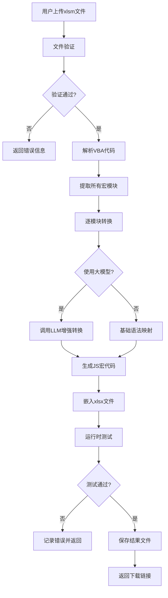
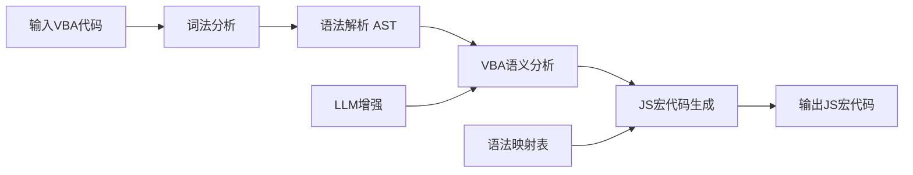

# VBA到WPS JS宏转换工具 - 技术方案文档

## 1. 需求分析

### 1.1 业务需求
- 用户提交带有VBA宏的Excel文件（.xlsm）
- 自动转换为带有WPS JS宏的版本（.xlsx）
- 确保功能一致性：100%语法正确，无运行时错误
- 支持大模型API配置，增强转换能力
- 转换过程可视化，支持阶段审视
- 支持运行时测试验证
- 提供Web服务接口和简易使用界面
- 支持Linux服务器部署

### 1.2 核心功能点
| 功能模块 | 描述 | 优先级 |
|---------|------|-------|
| 文件上传 | 支持.xlsm文件上传 | 高 |
| VBA解析 | 提取Excel中的VBA宏代码 | 高 |
| 语法转换 | VBA→JS宏语法转换 | 高 |
| 大模型集成 | 智能代码转换增强 | 高 |
| 结果生成 | 生成带JS宏的xlsx文件 | 高 |
| 测试验证 | 运行时测试确保正确性 | 高 |
| 过程展示 | 转换阶段可视化 | 中 |
| API服务 | RESTful接口 | 高 |

## 2. 系统架构设计

### 2.1 架构总览

```
┌─────────────────────────────────────────────────────────────────┐
│                     前端界面层 (Frontend)                        │
│  ┌────────────────┐  ┌────────────────┐  ┌─────────────────┐   │
│  │ 文件上传组件    │  │ 进度展示组件   │  │ 结果下载组件    │   │
│  └──────┬─────────┘  └──────┬─────────┘  └──────┬──────────┘   │
└─────────┼───────────────────┼───────────────────┼──────────────┘
          │                   │                   │
          ▼                   ▼                   ▼
┌─────────────────────────────────────────────────────────────────┐
│                     API网关层 (API Gateway)                      │
│                    /api/upload /api/convert /api/download       │
└───────────────────────────────┬─────────────────────────────────┘
                               │
                               ▼
┌─────────────────────────────────────────────────────────────────┐
│                    业务逻辑层 (Service Layer)                    │
│  ┌──────────────┐ ┌──────────────┐ ┌──────────────┐            │
│  │ FileService  │ │ ConvertService│ │ TestService  │            │
│  │ 文件处理     │ │ 转换引擎     │ │ 运行测试     │            │
│  └──────┬───────┘ └──────┬───────┘ └──────┬───────┘            │
└─────────┼─────────────────┼─────────────────┼───────────────────┘
          │                 │                 │
          ▼                 ▼                 ▼
┌─────────────────────────────────────────────────────────────────┐
│                    核心引擎层 (Engine Layer)                     │
│  ┌──────────────┐ ┌──────────────┐ ┌──────────────┐            │
│  │ VBAParser    │ │ SyntaxMapper │ │ LLMAgent     │            │
│  │ VBA解析器    │ │ 语法映射器   │ │ 大模型代理   │            │
│  └──────────────┘ └──────────────┘ └──────────────┘            │
└─────────────────────────────────────────────────────────────────┘
          │                 │                 │
          ▼                 ▼                 ▼
┌─────────────────────────────────────────────────────────────────┐
│                      数据存储层 (Storage)                        │
│  ┌──────────────┐ ┌──────────────┐ ┌──────────────┐            │
│  │ Uploads      │ │ Converted    │ │ Logs         │            │
│  │ 上传文件     │ │ 转换结果     │ │ 日志记录     │            │
│  └──────────────┘ └──────────────┘ └──────────────┘            │
└─────────────────────────────────────────────────────────────────┘
```

### 2.2 核心组件说明

| 组件 | 职责 | 技术实现 |
|------|------|----------|
| VBAParser | 解析xlsm文件，提取VBA代码 | Python + zipfile + olefile |
| SyntaxMapper | VBA语法到JS宏的映射转换 | Python + AST |
| LLMAgent | 大模型API调用，增强转换 | OpenAI API/自定义模型 |
| FileService | 文件上传、存储、下载 | Flask + 本地文件系统 |
| ConvertService | 协调转换流程 | Python |
| TestService | 运行时测试验证 | Node.js + xlsx库 |

### 2.3 技术选型

| 分类 | 技术 | 版本 | 选型理由 |
|------|------|------|----------|
| 语言 | Python | 3.10+ | 强大的文件处理能力，丰富的Excel库支持 |
| 语言 | JavaScript/TypeScript | ES2020+ | 前端界面和JS宏生成 |
| 框架 | Flask | 2.0+ | 轻量级Web框架，便于部署 |
| 前端 | Vue.js | 3.0+ | 响应式界面，组件化开发 |
| 数据库 | SQLite | 3.0+ | 轻量级，无需额外服务，适合日志存储 |
| Excel处理 | openpyxl | 3.0+ | 读写xlsx文件，支持宏存储 |
| VBA解析 | olefile | 0.46+ | 解析OLE2格式的VBA宏 |
| 大模型 | OpenAI API/自定义 | - | 智能代码转换增强 |

## 3. 数据流设计

### 3.1 转换流程



### 3.2 数据结构

#### 3.2.1 文件记录 (FileRecord)
```json
{
  "id": "string (UUID)",
  "original_name": "string",
  "upload_time": "datetime",
  "status": "pending|processing|completed|failed",
  "converted_path": "string (nullable)",
  "error_message": "string (nullable)",
  "progress": "integer (0-100)"
}
```

#### 3.2.2 转换任务 (ConvertTask)
```json
{
  "file_id": "string",
  "vba_modules": ["module_name": "string", "code": "string"],
  "js_modules": ["module_name": "string", "code": "string"],
  "stage": "parsing|converting|testing|completed",
  "errors": ["line": "integer", "message": "string"]
}
```

## 4. API接口设计

### 4.1 文件上传接口

| 属性 | 值 |
|------|-----|
| **路径** | `/api/upload` |
| **方法** | POST |
| **Content-Type** | multipart/form-data |
| **参数** | `file`: xlsm文件 |
| **返回** | `{ "file_id": "uuid", "status": "pending" }` |

### 4.2 转换状态查询

| 属性 | 值 |
|------|-----|
| **路径** | `/api/convert/status/{file_id}` |
| **方法** | GET |
| **返回** | `{ "status": "processing", "progress": 50, "stage": "converting" }` |

### 4.3 触发转换

| 属性 | 值 |
|------|-----|
| **路径** | `/api/convert/{file_id}` |
| **方法** | POST |
| **参数** | `use_llm`: boolean, `llm_config`: object |
| **返回** | `{ "task_id": "uuid", "status": "processing" }` |

### 4.4 下载结果

| 属性 | 值 |
|------|-----|
| **路径** | `/api/download/{file_id}` |
| **方法** | GET |
| **返回** | 文件流 (xlsx) |

### 4.5 LLM配置

| 属性 | 值 |
|------|-----|
| **路径** | `/api/config/llm` |
| **方法** | POST |
| **参数** | `{ "api_key": "string", "endpoint": "string", "model": "string" }` |
| **返回** | `{ "success": true }` |

## 5. 核心转换逻辑设计

### 5.1 VBA与JS宏语法映射

| VBA语法 | WPS JS宏语法 | 说明 |
|---------|-------------|------|
| `Sub Name()` | `function Name() {}` | 过程定义 |
| `Function Name()` | `function Name() {}` | 函数定义 |
| `Dim x As Integer` | `let x = 0` | 变量声明 |
| `Set obj = CreateObject()` | `let obj = new ActiveXObject()` | 对象创建 |
| `Range("A1").Value` | `Range("A1").Value` | 单元格访问 |
| `If...Then...End If` | `if...else...` | 条件语句 |
| `For...Next` | `for...` | 循环语句 |
| `MsgBox "text"` | `Application.MsgBox("text")` | 消息框 |
| `ThisWorkbook` | `ThisWorkbook` | 当前工作簿 |
| `Worksheets("Sheet1")` | `Worksheets("Sheet1")` | 工作表 |

### 5.2 转换引擎工作流程



### 5.3 LLM集成策略

1. **预转换处理**: 使用正则和语法映射处理简单转换
2. **复杂代码识别**: 识别难以直接映射的复杂模式
3. **LLM调用**: 对复杂代码片段调用大模型进行智能转换
4. **后处理验证**: 验证生成的JS代码语法正确性

## 6. 运行时测试设计

### 6.1 测试策略

1. **语法检查**: 使用ESLint验证JS宏语法
2. **API兼容性检查**: 检查WPS API调用是否正确
3. **单元测试**: 对关键函数进行测试
4. **集成测试**: 模拟WPS环境运行宏

### 6.2 测试用例设计

| 测试类型 | 测试内容 | 预期结果 |
|----------|----------|----------|
| 语法检查 | 变量声明、函数定义 | 无语法错误 |
| API检查 | Range访问、Worksheet操作 | 正确调用WPS API |
| 逻辑测试 | 循环、条件分支 | 执行结果正确 |
| 异常测试 | 错误处理、边界条件 | 正确捕获异常 |

## 7. 部署架构

### 7.1 服务器环境

| 组件 | 要求 |
|------|------|
| 操作系统 | Linux (Ubuntu 20.04+) |
| Python | 3.10+ |
| Node.js | 18+ |
| 内存 | 4GB+ |
| 存储 | 10GB+可用空间 |

### 7.2 目录结构

```
/opt/vba-converter/
├── app/                    # 应用代码
│   ├── __init__.py
│   ├── api/                # API路由
│   ├── engine/             # 转换引擎
│   ├── services/           # 业务服务
│   └── utils/              # 工具函数
├── frontend/               # 前端代码
│   ├── src/
│   ├── dist/
│   └── package.json
├── data/                   # 数据存储
│   ├── uploads/            # 上传文件
│   ├── converted/          # 转换结果
│   └── logs/               # 日志文件
├── config.py               # 配置文件
├── requirements.txt        # Python依赖
└── run.py                  # 启动脚本
```

### 7.3 配置文件说明

```python
# config.py
class Config:
    UPLOAD_FOLDER = '/opt/vba-converter/data/uploads'
    CONVERTED_FOLDER = '/opt/vba-converter/data/converted'
    LOG_FOLDER = '/opt/vba-converter/data/logs'
    MAX_CONTENT_LENGTH = 50 * 1024 * 1024  # 50MB
    
    # LLM配置
    LLM_API_KEY = None
    LLM_ENDPOINT = "https://api.openai.com/v1/chat/completions"
    LLM_MODEL = "gpt-4"
    
    # 数据库配置
    DATABASE_URI = "sqlite:///data/converter.db"
```

## 8. 安全设计

### 8.1 文件上传安全
- 限制文件类型：仅允许.xlsm文件
- 限制文件大小：最大50MB
- 文件内容扫描：检查是否包含恶意宏

### 8.2 API安全
- API密钥认证
- 请求频率限制
- 输入参数验证
- SQL注入防护

### 8.3 数据安全
- 文件存储加密
- 日志脱敏处理
- 定期清理临时文件

## 9. 性能优化

### 9.1 转换性能
- 并行处理多个文件
- 缓存常用转换模式
- 异步任务队列

### 9.2 响应优化
- 流式响应转换进度
- 前端懒加载
- CDN加速静态资源

## 10. 监控与日志

### 10.1 日志记录
- 请求日志
- 转换过程日志
- 错误日志

### 10.2 监控指标
- 转换成功率
- 平均转换时间
- 资源使用情况

---

**文档版本**: v1.0  
**创建时间**: 2024  
**适用场景**: Excel VBA宏到WPS JS宏自动转换